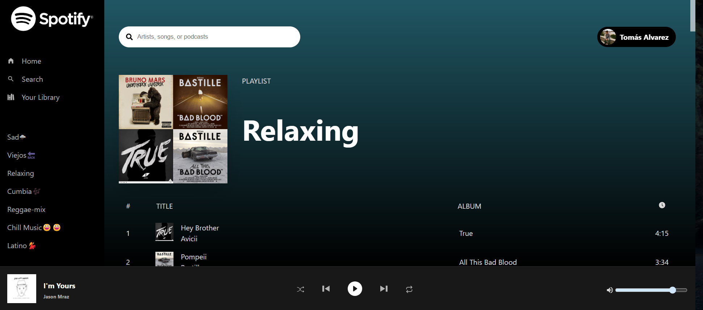

# Spotify Clone with React.js

## Description
A Spotify Clone application that utilizes the Spotify API to enable listening to your tracks and navigating through your playlists.



## Installation
Follow these steps to set up the Spotify Clone on your local machine:

1. Clone the repository:
   ```
   git clone https://github.com/17sTomy/spotify-clone.git
   ```
2. Install dependencies using npm:
   ```
   npm install
   ``` 
3. Run the server:
   ```
   npm run dev
   ```